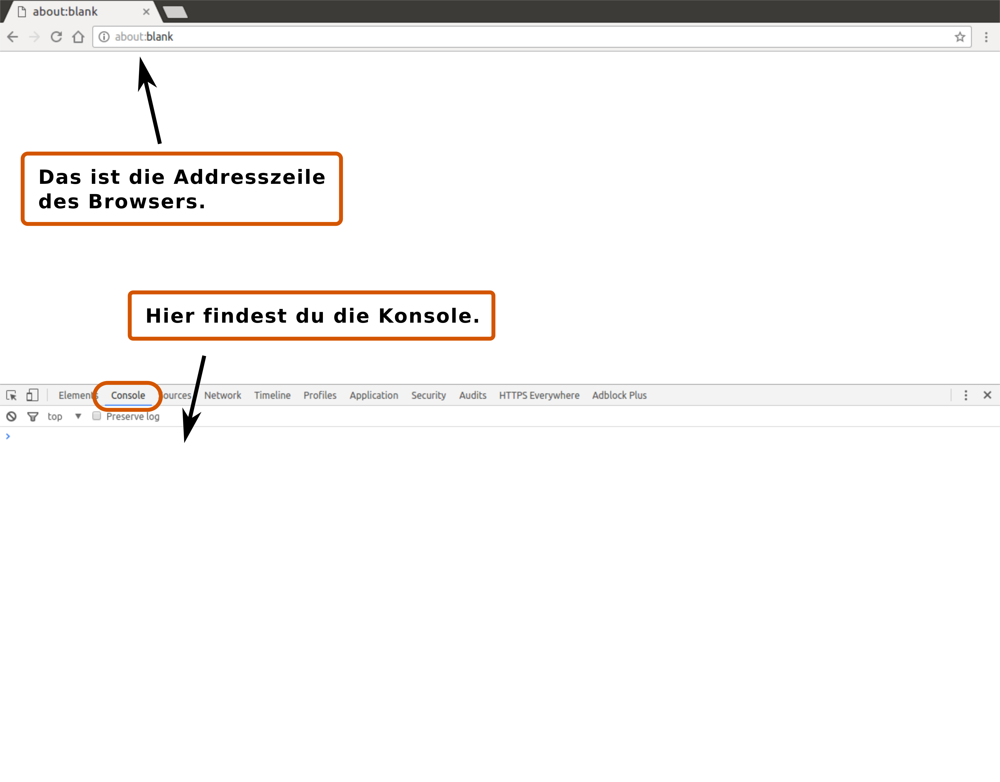

# Das erste Mal JavaScript schreiben

Um JavaScript auszuprobieren, brauchst du einen Browser. Am besten geht das mit dem Chrome Browser.

Vielleicht ist auf deinem Computer Chrome schon vorhanden, dann kannst du gleich loslegen. Ansonsten musst du das Programm von dieser Webseite runterladen und installieren: https://www.google.com/chrome

Starte den Browser und gib in der Adresszeile **about:blank** ein, so dass du eine leere Seite siehst. Dann drücke gleichzeitig die Tasten __SHIFT__, __Strg__ und __J__ (für Linux oder Windows) bzw. __COMMAND__, __OPTION__ und __J__ (für Mac). So öffnest du die **Konsole**. Programmierer benutzen diese um Programme zu testen und Fehler zu finden. In der Konsole siehst du neben einem kleinen Dreieck den Cursor blinken: **> |**.



Die Konsole stellt dein Programm mit verschiedenen Farben dar. Zum Beispiel ist Text den du eingibst blau. Wenn du nun Programmcode eingibst und __ENTER__ drückst, dann wird der Browser deinen Code **ausführen** (in englisch sagt man "execute") und das Ergebnis ausgeben.

Probiere es aus!
> **Übung**
>
> Gib folgende Zeile in der Konsole ein und drücke __ENTER__.

```javascript
3+4;
```

>JavaScript sollte dann das Ergebnis 7 ausgeben.

```
7
```

Ok, das war leicht. Aber JavaScript ist mehr als ein Taschenrechner. Wie wäre es mit ein Miezekatzen auf dem Bildschirm, die so ausssehen:

```
=^.^=
```

Kein Problem, dafür schreibst du ein kleines Programm. Mach dir nichts draus, wenn du noch nicht genau verstehst, was da passiert.

**Wichtig:** Wenn du Programme mit mehreren Zeilen eingeben willst, musst du __SHIFT__ und __ENTER__ gleichzeitig drücken. Wenn du nur __ENTER__ drückst, denkt der Browser du willst das Programm ausführen und meldet dir einen Fehler. Wie gesagt, Computer sind ziemlich dumm....

> **Übung**
>
> Gib folgenden Text in die Konsole ein (beachte hier die Zeilenumbrüche!).

```javascript
// Zeichne soviele Katzen wie du willst
var zeichneKatzen = function(wieviele){
  for(var i=0; i<wieviele; i++){
    console.log(i + " =^.^=");
}};
```

> Zeichne die Katzen. Für den Anfang reichen 5.

```javascript
zeichneKatzen(5);
```

Wenn alles geklappt hat und im Programm keine Tippfehler sind, müsstest du das hier sehen:
```
0 =^.^=
1 =^.^=
2 =^.^=
3 =^.^=
4 =^.^=
```

Du kannst auch mehr oder weniger Katzen zeichnen, wenn du in der letzten Codezeile eine andere Zahl als 5 in der Klammer eingibst. Probiere es aus.

## Syntax

In unserem kleinen Katzenprogramm sind viele seltsame Zeichen, wie z.B. das Semikolon (Strichpunkt) **;** oder geschweifte Klammmern **{}**. Und es gibt komische Worte, wie z.B. **var**, **console.log** und **for**. Das nennt man die **Syntax** von JavaScript, also all die Regeln und Vokablen, die man braucht, um ein Programm zu schreiben. Jede Programmiersprache hat ihre eigene Syntax.

## Kommentare

Vielleicht ist dir in der Übung aufgefallen, dass vor der ersten Zeile zwei Schrägstriche (in englisch "Slash") stehen. Damit werden **Kommentare** gekennzeichnet. Der Computer weiß dann, dass alles was auf dieser Zeile steht, nicht zum Programm gehört sondern für den Programmierer oder die Programmierin bestimmt ist. Kommentare sind super, um zu beschreiben was in deinem Code passiert. Grade am Anfang ist das hilfreich.
Der Computer führt Kommentare nie aus, selbst wenn dort Code steht.

> **Übung**
>
> Gib folgendes Beispiel in der Konsole. Was denkst du was der Computer ausgeben wird?

```javascript
// 3+4;
5+8;
```

Als Ausgabe solltest du folgendes sehen, denn die erste Zeile war ja ein Kommentar und wurde nicht ausgeführt:
```
8
```

# Was du gelernt hast

Du kannst im Chrome Browser die Konsole öffnen und weißt wie du ein Programm eingeben musst. Du hast gesehen was Kommentare sind und weißt dass JavaScript eine Syntax hat.
